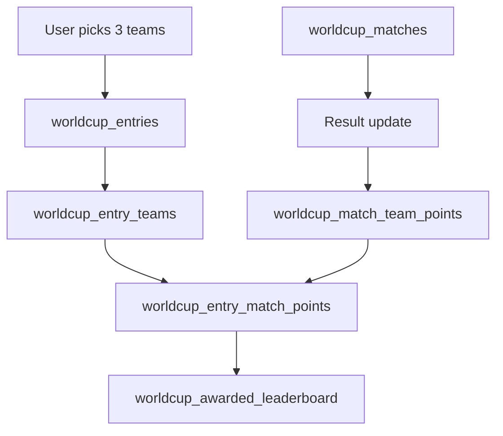

# Architecture

WorldCup is implemented as a Supabase-backed fantasy leaderboard game.

The application layer is a Next.js app. Public tournament data is read through the Supabase anon key. Result updates and cron operations run through server routes that use the Supabase service-role key.

## Product Model

The user does not predict every match. Instead:

1. A user creates an entry.
2. The user selects exactly 3 teams.
3. The selected teams earn points throughout the tournament.
4. The final user score is the sum of all awarded team points.
5. The leaderboard ranks locked entries by total score.

## Data Flow

## Design Principles

- Keep team coefficients fixed for the whole competition.
- Keep stage coefficients separate from team coefficients.
- Store raw match results once, then derive team points.
- Use an award ledger to avoid double-counting when cron jobs retry.
- Keep the existing generic Games tables untouched.

## Supabase Layers

### Reference Data

- `worldcup_tournaments`
- `worldcup_stages`
- `worldcup_teams`
- `worldcup_matches`

### User Game Data

- `worldcup_entries`
- `worldcup_entry_teams`

### Scoring Data

- `worldcup_match_team_points`
- `worldcup_entry_match_points`
- `worldcup_entry_team_totals`
- `worldcup_leaderboard`
- `worldcup_awarded_leaderboard`

## Why Dedicated Tables

The Games project already has generic tables such as `games`, `tournaments`, and `player_scores`. WorldCup uses dedicated `worldcup_*` tables so football scoring, fixtures, coefficients, and cron processing stay clean and do not disturb existing game features.

## Web Application Routes

### `/`

Main dashboard:

- choose exactly 3 teams
- read the in-app rules and scoring formula
- lock entry
- view leaderboard
- inspect match schedule
- manually enter results through the admin fallback form

### `/api/entries`

Creates and locks a user entry after exactly 3 valid teams are selected. Late entries are allowed, but each selected team must still be before kickoff of its second group-stage match. The database also enforces this cutoff on `worldcup_entry_teams` inserts.

### `/api/admin/results`

Server-only result fallback. Requires `ADMIN_RESULT_SECRET` and updates one match result, then applies points for that match.

### `/api/cron/results`

Cron endpoint. Requires `CRON_SECRET`. It checks due matches, optionally fetches results from `RESULT_API_URL`, updates completed matches, and applies points.

### `/api/cron/apply`

Cron helper endpoint. Requires `CRON_SECRET`. It applies points for all completed matches that have not yet been awarded.
