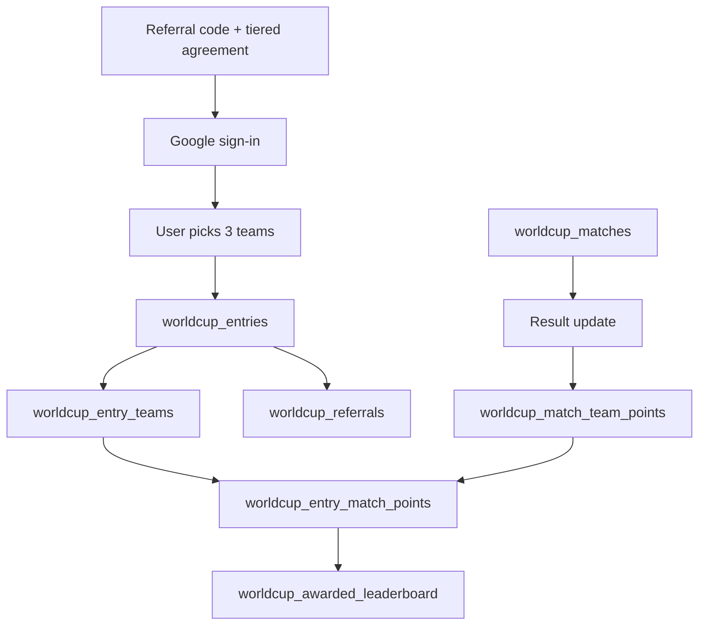

# Architecture

WorldCup is implemented as a Supabase-backed fantasy leaderboard game.

The application layer is a Next.js app. Public tournament data is read through the Supabase anon key. Result updates and cron operations run through server routes that use the Supabase service-role key.

## Product Model

The user does not predict every match. Instead:

1. A user enters a referral code or confirms that they do not have one.
2. A user signs in with Google.
3. The user creates an entry.
4. The user selects exactly 3 teams.
5. The selected teams earn points throughout the tournament.
6. The final user score is the sum of all awarded team points.
7. The leaderboard ranks locked entries by total score.

## Data Flow

## Design Principles

- Keep team coefficients fixed for the whole competition.
- Keep stage coefficients separate from team coefficients.
- Store raw match results once, then derive team points.
- Use an award ledger to avoid double-counting when cron jobs retry.
- Keep the existing generic Games tables untouched.
- Show only the final public prize pool to players; keep the tournament fee internal.
- Pay top 10 places when there are 100+ participants, otherwise pay the top 10% rounded up.
- Split paid places with the weighted curve 35/20/13/9/7/5/4/3/2/2, normalized for fewer paid places.
- Keep raw entries, picks, referral profiles, referral agreements, tickets, and wallet transactions private behind RLS.
- Require one assigned ticket before an authenticated user can lock an entry.
- Record wallet transfers as an internal ledger, not as external bank/payment movement.

## Supabase Layers

### Reference Data

- `worldcup_tournaments`
- `worldcup_stages`
- `worldcup_teams`
- `worldcup_matches`

### User Game Data

- `worldcup_entries`
- `worldcup_entry_teams`
- `worldcup_tickets`
- `worldcup_wallet_transactions`

### Scoring Data

- `worldcup_match_team_points`
- `worldcup_entry_match_points`
- `worldcup_entry_team_totals`
- `worldcup_leaderboard`
- `worldcup_awarded_leaderboard`

## Why Dedicated Tables

The Games project already has generic tables such as `games`, `tournaments`, and `player_scores`. WorldCup uses dedicated `worldcup_*` tables so football scoring, fixtures, coefficients, and cron processing stay clean and do not disturb existing game features.

## Web Application Routes

### `/`

Main dashboard:

- choose exactly 3 teams
- read the in-app rules and scoring formula
- open the full tournament schema from group stage to final
- lock entry
- view leaderboard
- view own assigned tickets and internal wallet balance after Google login
- inspect match schedule
- manually enter results through the admin fallback form

### `/login`

Dedicated login/register gate. Users enter a referral code or confirm that they do not have one before creating an account with Google. Referral codes are resolved on this page, the referred player accepts the referred-winner agreement, and then OAuth redirects back to the dashboard. Users who join through a referral can earn 5% from their own referred winners; users who join without a referral can still invite, but earn 3%.

### `/schema`

Shows all 104 matches from group stage through the final. The page includes group standings, winner/runner-up/third-place qualification paths, a knockout draw board, and detailed match rows. Completed matches display the calculated team points that are added to users who selected each team; scheduled matches show points as pending.

### `/api/entries`

Creates and locks a user entry after exactly 3 valid teams are selected. Late entries are allowed, but each selected team must still be before kickoff of its second group-stage match. The database also enforces this cutoff on `worldcup_entry_teams` inserts. The API requires one unused assigned ticket and consumes it when the entry is locked.

### `/api/admin/results`

Server-only result fallback. Requires `ADMIN_RESULT_SECRET` and updates one match result, then applies points for that match.

### `/api/admin/referrals`

Server-only referral report. Requires `ADMIN_RESULT_SECRET` and returns accepted referral agreements with inviter, referred entry, accepted timestamp, percentage tier, and current leaderboard position for payout auditing.

### `/api/admin/settlement`

Server-only payout audit report. Requires `ADMIN_RESULT_SECRET` and returns current paid leaderboard entries with gross prize, referral obligation, winner net amount, and report totals. It does not move wallet funds.

### `/api/admin/prize-pool`

Server-only prize pool update. Requires `ADMIN_RESULT_SECRET`, stores the collected amount on the tournament, and keeps the public prize pool calculated internally without exposing the fee in the player UI.

### `/api/admin/accounts`

Server-only account report. Requires `ADMIN_RESULT_SECRET` and returns Google/referral profiles with wallet balance, assigned ticket count, and available ticket count.

### `/api/admin/tickets`

Server-only ticket management. Requires `ADMIN_RESULT_SECRET`. Admins can set the ticket price for the tournament and assign one or more tickets to an existing account.

### `/api/admin/wallet-transfer`

Server-only internal wallet transfer. Requires `ADMIN_RESULT_SECRET`. Records an audited transfer from one existing account wallet to another existing account wallet after checking the source balance.

### `/api/cron/results`

Cron endpoint. Requires `CRON_SECRET`. It checks due matches, optionally fetches results from `RESULT_API_URL`, updates completed matches, and applies points.

### `/api/cron/apply`

Cron helper endpoint. Requires `CRON_SECRET`. It applies points for all completed matches that have not yet been awarded.

## Security Hardening

- Private WorldCup tables are not directly readable or writable with the anon key.
- Admin endpoints use a shared server-side secret verifier as an interim control.
- Public responses include baseline security headers from `next.config.ts`.
- Vercel schedules both result ingestion and a point-application retry cron.
